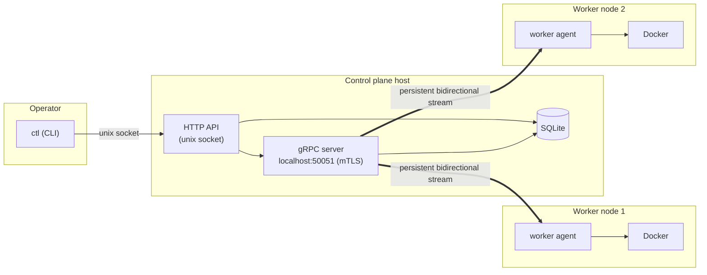
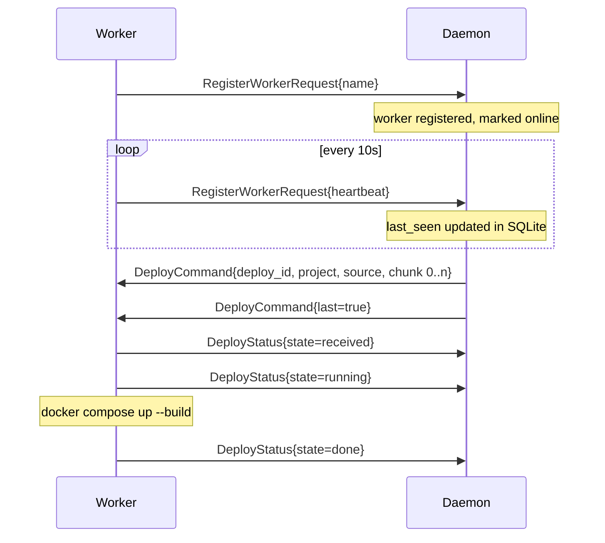
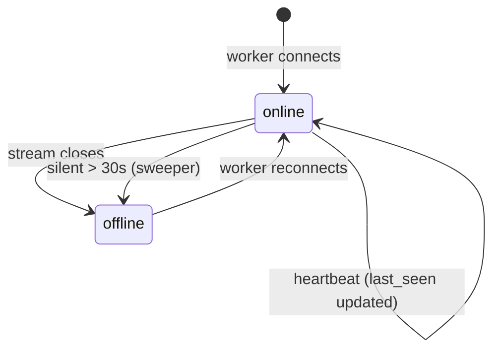
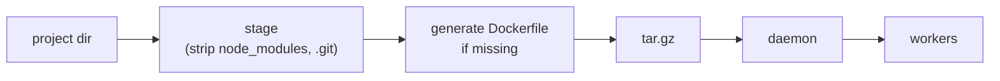
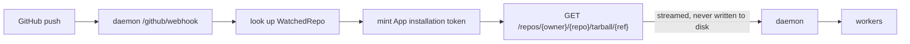

# Architecture

ControlPlane is a self-hosted deployment orchestrator. A **control plane daemon**
runs on one machine and manages a fleet of **worker nodes**; each worker runs
Docker and is told what to build and run over a persistent gRPC stream.

The goal is: point it at a project directory (or a GitHub repository) and have it
built and running on your worker nodes, without you touching Docker directly.

---

## Components



There are three binaries:

| Binary | Source | Role |
|---|---|---|
| `daemon` | `cp/cmd/daemon` | Control plane. Holds state, receives commands, drives workers. |
| `ctl` | `cp/cmd/ctl` | Operator CLI. Talks to the daemon over a unix socket. |
| `worker` | `workers/cmd/worker` | Worker agent. Connects out to the daemon and runs Docker. |

The worker **dials out** to the daemon. The daemon never connects *to* a worker,
so workers can sit behind NAT as long as they can reach the daemon.

---

## The persistent stream

Each worker holds exactly **one** long-lived bidirectional gRPC stream open
(`RegisterWorker.Register`) for its whole lifetime. Every message in both
directions travels over that one stream — there is no second channel, no polling,
and no worker-side HTTP server.



**Message types**

| Direction | Message | Purpose |
|---|---|---|
| worker → daemon | `RegisterWorkerRequest.name` | Identity, sent first. Taken from the bootstrap token. |
| worker → daemon | `RegisterWorkerRequest.heartbeat` | Liveness. |
| worker → daemon | `RegisterWorkerRequest.status` | `DeployStatus` for a deploy. |
| daemon → worker | `RegisterWorkerResponse.deploy` | `DeployCommand`, one chunk per message. |

**Why chunked.** `DeployCommand` carries `bytes chunk` plus `chunk_index` and
`last`, so a project is streamed in 512KB pieces rather than one giant message.
This keeps every message well under gRPC's 4MiB default limit and, more
importantly, means the daemon can forward a project it is itself receiving
(GitHub tarball → worker) without ever buffering or writing it to disk.

**The one-writer rule.** Concurrent `Send` calls on a single gRPC stream are not
safe. On both sides exactly one goroutine owns the stream and writes to it;
everything else queues a message on a channel (`workerConn.send` in the daemon,
`GrpcClient.send` in the worker). This is the most important invariant in the
codebase — breaking it corrupts the stream.

---

## Control plane daemon

### HTTP API over a unix socket

The daemon serves its operator API on `/tmp/cplane.sock` (mode `0700`), *not* on
a TCP port. The CLI is expected to run on the same host. This keeps the control
surface off the network entirely — no auth is needed on these endpoints because
filesystem permissions are the access control.

Routes are registered in `cp/cmd/daemon/main.go`; the full list is in
[commands.md](./commands.md#daemon-http-api).

### Config loading is deferred

The daemon does **not** read its config at startup. It starts with only the unix
socket, and `ctl run --config <path>` is what triggers
`ParseConfig` → database open → migrations → PKI bootstrap → gRPC server start.

This is deliberate but awkward: it means the daemon has no state between
restarts, and you must run `ctl run` after every daemon start. A restart
therefore needs the config path supplied again.

`ControlPlane` holds the loaded state (`cp/cmd/daemon/main.go`):

```go
type ControlPlane struct {
    CertManager pki.CertificateManager
    Config      Config
    DB          gorm.DB
    Github      githubFlow
    Workers     *workerRegistry  // who is connected right now
    Grpc        *GrpcServer
    WorkerStore *workerStore     // liveness, persisted
}
```

`Grpc` is constructed in `main()` but only *started* from `Run`, because starting
it needs the TLS certificates, which come from the config.

### Worker registry

`cp/cmd/daemon/registry.go` tracks connected workers in memory:

- `workerRegistry` maps name → `workerConn` (a channel plus a `closed` signal).
- `registerStream` owns each worker's stream: it reads heartbeats in a
  background goroutine and is the only writer.
- `targets(names)` resolves a request into connections. **An empty list means
  every connected worker** — the default for deploys.
- `DeployStream` reads the archive once and fans it out chunk by chunk. A worker
  that stops accepting chunks is dropped from the fan-out rather than stalling
  the others.
- `deployTracker` records the latest `DeployStatus` per deploy id.

### Liveness and the offline timeout

Timings live in one place, `pkg/cluster`, imported by **both** the daemon and the
worker so the two can never disagree:

| Constant | Value | Meaning |
|---|---|---|
| `HeartbeatInterval` | 10s | Worker reports in this often. |
| `OfflineAfter` | 30s | `3 × HeartbeatInterval`. After this silence, the worker is offline. |
| `SweepInterval` | 10s | How often the daemon checks. |



A **sweeper** goroutine runs every 10s and looks for workers still marked online
whose `last_seen` is older than `OfflineAfter`. For each one it:

1. sets `status = offline` in SQLite,
2. forces the stream shut (`workerConn.shutdown()`),
3. drops the worker from the routing table so fan-out skips it.

Step 3 is the reallocation hook: without it a worker that had *hung* (stream open,
process wedged) would stay in the routing table forever and keep receiving
deploys it never acts on.

Heartbeats are sent by the worker's main loop while a build runs in a separate
goroutine, so **a long docker build never looks like a dead worker**.

---

## Worker node

### Startup

```
worker --join-address localhost:50051 --token <bootstrap> --config /tmp/worker/
```

1. `LoadBootstrapToken` decodes the base64 token, which contains the worker's
   **name** plus its CA cert, worker cert and private key.
2. Those are written into `--config` as `ca.crt`, `worker.crt`, `worker.key`.
3. The worker dials the daemon with mTLS and sends its name.
4. It then stays connected, sending heartbeats and handling deploys, until
   interrupted (`SIGINT`/`SIGTERM`).

### Handling a deploy

`acceptChunk` appends each chunk to a temp file
(`os.TempDir()/cplane-<deploy_id>.tar.gz`). When `last` arrives it spawns
`buildProject` in a goroutine — so the receive loop stays free and heartbeats keep
flowing — which:

1. unpacks the archive into `<config>/projects/<project>`,
2. resolves the real project root (GitHub tarballs are wrapped in an
   `owner-repo-sha/` directory; a `node_modules`-free archive is not),
3. generates a `Dockerfile` and `docker-compose.yml` if the project has none,
4. runs `docker compose -p <project>-<workerName> up --build`,
5. reports `received` → `running` → `done`/`failed`.

The compose project is scoped per worker so two workers sharing one Docker host
don't collide on container or network names.

### Docker access

`workers/docker/docker.go` wraps the official Docker SDK for building images and
running containers. Compose is a Docker **CLI plugin** with no Go API, so
`workers/docker/compose.go` shells out to the `docker` binary instead. That is
the one place the worker depends on the CLI rather than the SDK.

---

## Deploy paths

### From a local directory



The daemon stages into a scratch directory so the generated `Dockerfile` never
touches your real project, then streams it. `node_modules` and `.git` are
excluded — they are reinstalled inside the image and `.git` is useless for
building.

### From GitHub



On a push the daemon verifies the `X-Hub-Signature-256` HMAC against
`webhookSecret`, looks the repository up in the `watched_repos` table, checks the
branch matches, and then — in a background goroutine, because GitHub expects a
prompt response — fetches the repository tarball and pipes it straight through to
the workers. **The daemon never writes the repository to disk.**

Which workers a repository deploys to is decided at `ctl github watch` time and
persisted; empty means all workers.

---

## Security model

Mutual TLS everywhere on the gRPC link. Certificates are generated by the daemon
on first `ctl run`:

| File | Purpose |
|---|---|
| `caCert.crt` / `caKey.key` | Self-signed CA. |
| `serverCert.crt` / `serverKey.key` | Daemon's server certificate. |
| *(per worker)* | Issued into the bootstrap token. |

- The daemon requires and verifies client certificates (`RequireAndVerifyClientCert`).
- The CA pool is built fresh from the CA cert rather than using system roots, so
  only certs from *this* control plane are accepted.
- The gRPC server binds `localhost:50051` — reachable only from the same host
  until that is changed.

---

## Data model

SQLite via GORM (`cp/internal/db/models.go`):

| Model | Purpose |
|---|---|
| `Workers` | Known workers: `Name`, `LastSeen`, `Status`. Survives restarts. |
| `Deployments` | Deployment records (`GithubURL`, `WorkerID`). Present but not yet written to. |
| `GithubCredential` | The linked GitHub account and its token. Single row. |
| `WatchedRepo` | Repos whose pushes deploy automatically: `RepoFullName`, `Project`, `Workers` (CSV), `Branch`. |

There is no user model yet, so `GithubCredential` is effectively a singleton.

---

## Package layout

```
cp/cmd/ctl/           CLI (cobra commands)
cp/cmd/daemon/        control plane daemon
    main.go           startup, HTTP routes, config, migrations
    grpc.go           mTLS gRPC server, Echo + Register services
    registry.go       connected workers, fan-out streaming, deploy tracking
    deploy.go         /deploy handler, GitHub tarball streaming
    github.go         device flow, webhook, installation tokens
    workers.go        worker liveness store, sweeper, /workers
    yml-parser.go     Config struct + YAML loading
cp/internal/db/       GORM models
cp/internal/github/   GitHub API client (package ghclient)
cp/internal/pki/      CA + certificate issuance
cp/internal/utils/    GitHub App JWT signing
cp/internal/generated/ gorm-gen output (not imported by anything)
pkg/cluster/          shared heartbeat timings
pkg/deploy/           staging, archiving, unpacking, project detection
pkg/proto/            generated protobuf + gRPC stubs
workers/cmd/worker/   worker agent
workers/docker/       Docker SDK wrapper + compose runner
workers/pki/          bootstrap token handling
workers/examples/     sample node app used for testing
```

`pkg/` is shared by both sides; `cp/internal/` is control-plane only. Note that
`workers/` **cannot** import `cp/internal/...` — Go's internal rule forbids it —
which is why the shared deploy helpers live in `pkg/deploy`.

---

## Known limitations

These are real and worth knowing before relying on the system:

- **The daemon address is hardcoded.** Workers always dial `localhost:50051`;
  `--join-address` is validated but not used. Remote workers will not connect
  until this is wired up.
- **The gRPC server binds localhost only.** Same reason as above.
- **No automatic reconnection.** If the stream drops the worker exits; there is
  no retry/backoff loop. Run it under a supervisor for now.
- **Config is not persisted by the daemon.** Every daemon restart needs
  `ctl run --config ...` again.
- **`Deployments` is never written to.** There is no deployment history.
- **`/github/webhook` requires a public URL.** `github.webhookUrl` is still a
  placeholder, so the webhook path has not been exercised end to end.
- **Single GitHub account.** `GithubCredential` is one row; there is no
  multi-tenancy.
- **No resource limits or scheduling.** Priority and CPU/memory allocation are
  not implemented; a deploy goes to all targeted workers or none.
